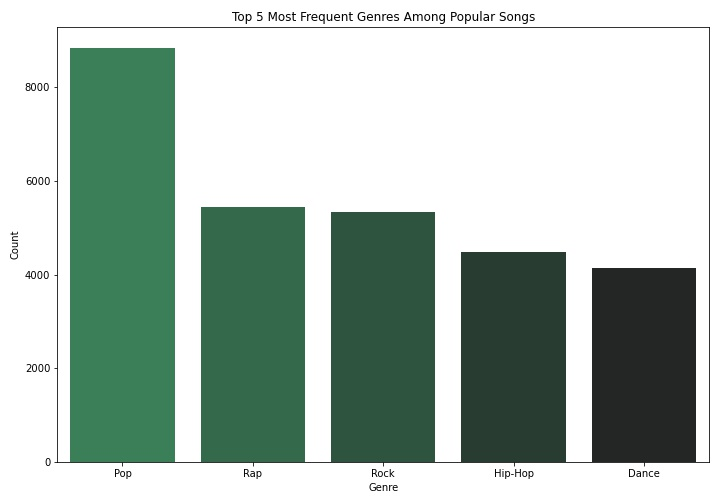
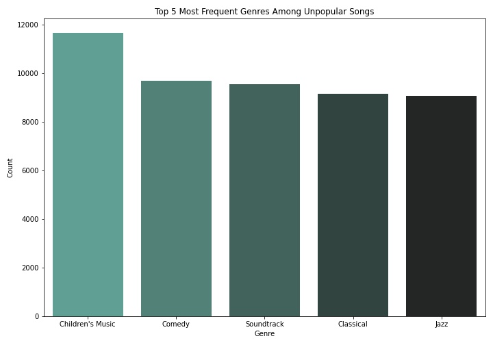
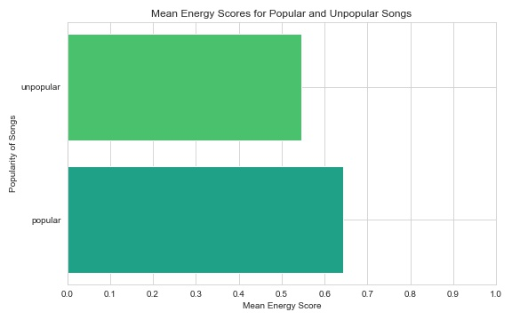
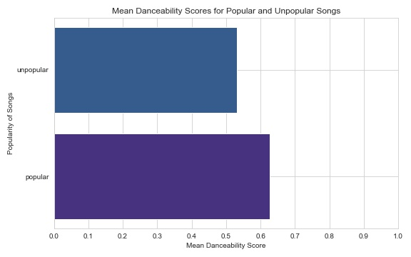
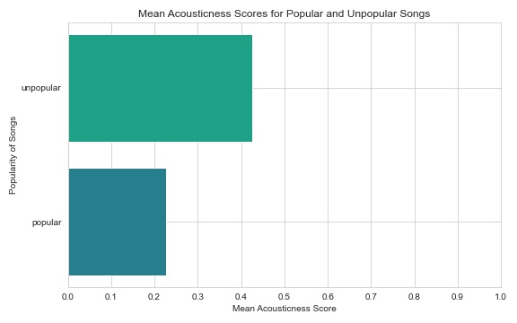

# Song Popularity Prediction

* This is my learning journey towards to Music Trend Analysis. And it is referred to E.Berke's work.

**Reference:** [Music Streaming Wars: Song Popularity Prediction, E. Berke Tezcan](https://github.com/harikimu/Spotify-Song-Popularity-Prediction/)

## Introduction

With Apple Music announcing on May 17th that they will be providing lossless audio along with spatial audio by Dolby Atmos for their subscribers and Tidal continuously providing exclusive content from artists, the competition among audio streaming platforms is heating up. Spotify would like to stay competitive by being able to predict which songs are going to be popular ahead of time so that they can curate even better playlists and sign deals with up-and-coming artists to have exclusivity on their content. This would not only help retain the current subscribers but also help market the platform to new subscribers as well.

For this project, we were hired by Spotify to train and test a machine learning model that can accurately predict whether a song is going to be popular or not. In order to achieve this, we will be testing out different machine learning models and will look at what attributes of a song are the most important for determining its popularity.

## Data

We used a dataset that has approximately 232,000 tracks from 2019 that was collected from Spotify's API and published on Kaggle for public use. The dataset can be found in the following link:
&nbsp;

Spotify Tracks DB - https://www.kaggle.com/zaheenhamidani/ultimate-spotify-tracks-db

Since we ran classification models we had to feature engineer a column that required us to use additional data to determine whether a song was popular or not (see below Methods section for more information). The data used for this purpose was also gathered from Spotify's API and is available on Kaggle:
&nbsp;

- Top 50 Songs - 2019: https://www.kaggle.com/leonardopena/top50spotify2019
- Top 100 Songs - 2019: https://www.kaggle.com/reach2ashish/top-100-spotify-songs-2019

## Methods

We started off with exploratory data analysis (EDA) to understand the columns and the dataset overall. The detailed explanation of each column can be found in Appendix A. During the EDA, we found that the "Children's Music" genre was duplicated due to different characters used in the dataset. After addressing this discrepancy by renaming this genre, we saw that approximately 56,000 tracks were duplicated. We proceeded to group the data by their unique id numbers, and kept the maximum values of each column among the duplicated values (refer to the notebook for more information). Additionally, we checked to see if there were any missing values in the dataset and did not find any.

We then had to feature engineer our target column by using the popularity scores column. We binarize this column by establishing a cutoff popularity score. After looking at the range of popularity scores within Top 50 and Top 100 songs from the same year, we established the cutoff point to be greater than or equal to 58 out of 100. 

After this, we proceeded with one hot encoding the categorical columns "key", "mode" and "time_signature". The dataset was then ready to be split into training and testing sets and used to train our models. Our modelling process started with training a baseline dummy classifier model for comparison and continued with training/testing a Random Forest model, XGBoost model and a Logistic Regression model. We additionally used grid searches that optimized for the recall scores to tune the hyperparameters of these models. 

Due to a class imbalance problem, we additionally had to use SMOTENC on our data prior to training the models. The outliers in the data were also removed and the dataset as a whole was scaled prior to training and testing the Logistic regression models. 

## Results

Below are the results for our models ranked by their recall scores in correctly predicting popular songs:

| Model Type      | Recall Score
| ------------- |-----:|
| Logistic Regression| 0.66 |
| XGBoost | 0.65 |
| Random Forest| 0.60 |
| Dummy Classifier| 0.51 |

&nbsp;

The best model we trained, Logistic Regression, performed 15% better compared to the dummy classifier at 66% correct predictions for a song being popular.

Aside from the models, we additionally explored different attributes within the popular songs and the unpopular songs separately.

### Top 5 Genres within Popular Songs
&nbsp;

> Above bar graph shows us the most frequent genres among popular songs. Most frequently a popular song had Pop as their genre followed by Rap, Rock, Hip-Hop and Dance. These results make sense and are in-line with a survey conducted by IFPI (https://www.statista.com/chart/15763/most-popular-music-genres-worldwide/).

&nbsp;

### Top 5 Genres within Unpopular Songs

> The most frequent genres of unpopular songs can be seen above. The results make sense as these genres tend to have a more niche fanbase or are not represented in the mainstream media as much as other genres. 

&nbsp;
### Energy Scores of Songs by Popularity
&nbsp;

> As we can see above, popular songs tended to be more energetic compared to unpopular songs. This makes sense since the most frequent genres we explored tend to also be energetic genres.

&nbsp;
### Danceability Scores of Songs by Popularity
&nbsp;

> Above, it is clear that the popular songs tended to have a higher danceability score compared to unpopular songs. This follows the same trend as the energy scores where majority of the popular songs are high energy and danceable (refer to Appendix A for definition of "danceability": high tempo, high beat strength etc.)

&nbsp;
### Acousticness Scores of Songs by Popularity
&nbsp;

> Similar to the energy and danceability scores we see that the popular songs tended to have a lower acousticness score. Since acoustic songs are usually lower energy and rarely danceable this follows the same trend we've been observing.

&nbsp;

## Conclusions & Recommendations

In a competitive environment like the music streaming market, it is vital to retain current subscribers and add new subscribers over time. By accurately predicting which song will be popular next, companies like Spotify can leverage this information to create better playlists and find and sign exclusivity deals with established and up-and-coming artists more easily.  To sum up, our analysis of approximately 176,000 songs from 2019 showed the following:

- Popular songs tend to have Pop, Rap, Rock, Hip-Hop and Dance as their genres.
- More niche genres such as Children's Music, Comedy, Soundtracks, Classical and Jazz tend to be unpopular.
- Generally, popular songs are higher energy, danceable, and therefore less acoustic.

Our recommendations to Spotify for leveraging this information would be the following:

- By identifying the next popular songs, Spotify can reach out to these artists and sign exclusivity deals with them to make their soon-to-be popular music available only on Spotify's platform. This would also help in identifying up-and-coming artists and may provide additional opportunities in the future.

- Furthermore, Spotify can work with these artists on additional exclusive content such as song commentary or behind the scenes recordings.

- Spotify can also curate even better playlists for their current subscribers by finding "fresh hits" ahead of the competition and use this to market the platform to new subscribers.

We think that by utilizing our model and the insights we've highlighted, Spotify will stay competitive in the music streaming market for years to come.
